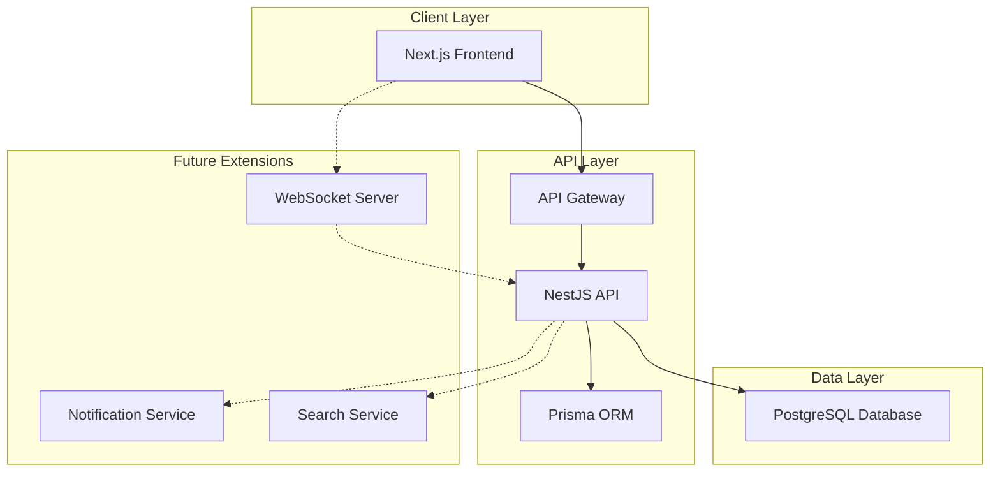

# ConnectVerse - Professional Social Network

<p align="center">
  
  
  
  
  
  
  
  
</p>

## 📋 Table of Contents

- [Core Concept](#-core-concept)
- [System Architecture](#️-system-architecture)
- [Key Features](#-key-features)
- [Technology Stack](#-technology-stack)
- [Engineering Challenges](#-engineering-challenges)
- [Prerequisites](#-prerequisites)
- [Getting Started](#️-getting-started)
- [Project Roadmap](#-project-roadmap)

## 🌟 Core Concept

ConnectVerse is a professional social networking platform designed to connect professionals, showcase skills, and build meaningful career connections. The platform focuses on delivering a seamless user experience with performance, security, and scalability as core principles.

## 🏗️ System Architecture



The system is built as a monorepo with npm workspaces, allowing for shared code while maintaining clear boundaries between services. The Next.js frontend communicates with a NestJS backend via REST APIs for core operations, with future plans to add real-time notifications via WebSockets.

## 📱 Key Features

- [ ] User authentication (NextAuth with OAuth providers)
- [ ] Professional profile creation and management
- [ ] Connection requests (send, accept, decline)
- [ ] Network visualization and management
- [ ] Advanced user search with filters
- [ ] Skills endorsement system
- [ ] Responsive design for all devices

## 🚀 Technology Stack

| Category           | Technology                                            | Rationale                                               |
| ------------------ | ----------------------------------------------------- | ------------------------------------------------------- |
| **Frontend**       | Next.js + React + TypeScript                          | Industry standard for performant, SEO-friendly web apps |
| **API**            | NestJS + TypeScript                                   | Enterprise-grade Node.js framework with strong typing   |
| **Database**       | PostgreSQL                                            | ACID compliance, excellent for relational data modeling |
| **ORM**            | Prisma                                                | Type-safe database access with migrations               |
| **CSS**            | Tailwind CSS                                          | Utility-first approach for rapid UI development         |
| **Authentication** | NextAuth.js                                           | Flexible auth system with multiple providers            |
| **Testing**        | Jest (API), React Testing Library (UI)                | Comprehensive testing strategy                          |
| **Deployment**     | Vercel (web), Fly.io/Render (API), Neon/Supabase (DB) | Modern cloud platforms with excellent DX                |

## 🧠 Engineering Challenges

### **Challenge 1: Efficient Network Graph**

- **Problem:** Modeling and querying a complex social graph efficiently.
- **Solution:** Leverage PostgreSQL's recursive CTEs and indexing for optimal graph traversal.

### **Challenge 2: Type-Safe Full-Stack Development**

- **Problem:** Maintaining type consistency across frontend and backend.
- **Solution:** Share TypeScript interfaces between services, use Prisma for type-safe database access.

### **Challenge 3: Authentication & Authorization**

- **Problem:** Secure, seamless auth flow with multiple providers.
- **Solution:** NextAuth integration with role-based access control and JWT session management.

## 📋 Prerequisites

- Node.js 22+ and npm
- Docker Desktop (for PostgreSQL)
- Git

## 🛠️ Getting Started

1. **Clone the repository**

   ```bash
   git clone https://github.com/SakshamKapoor2911/ConnectVerse.git
   cd ConnectVerse
   ```

2. **Install dependencies**

   ```bash
   npm install
   ```

3. **Set up environment variables**

   ```bash
   cp .env.example .env
   # Edit .env with your values
   ```

4. **Start PostgreSQL with Docker**

   ```bash
   docker compose up -d
   ```

5. **Run the application**

   ```bash
   # Start both API and web app in development mode
   npm run dev

   # Or start them separately
   npm run dev:api
   npm run dev:web
   ```

6. **Access the application**
   - Web: http://localhost:3000
   - API: http://localhost:4000

## 📋 Project Roadmap

Check our [Plan.md](Plan.md) file for the detailed project roadmap and progress tracking.

## 🧪 Current Progress

- [x] Monorepo setup with npm workspaces
- [x] Next.js app scaffolding with TypeScript and Tailwind CSS
- [x] NestJS API scaffolding
- [x] Docker setup for PostgreSQL
- [x] VS Code configuration
- [x] Prisma integration and data models
- [x] Database migrations and schema setup
- [x] API health check endpoint
- [x] Frontend-backend connection test
- [ ] Auth implementation with NextAuth (coming soon)
- [ ] User profiles and connections (in progress)

---

_Built with 💼 for professional connections in the digital age_
