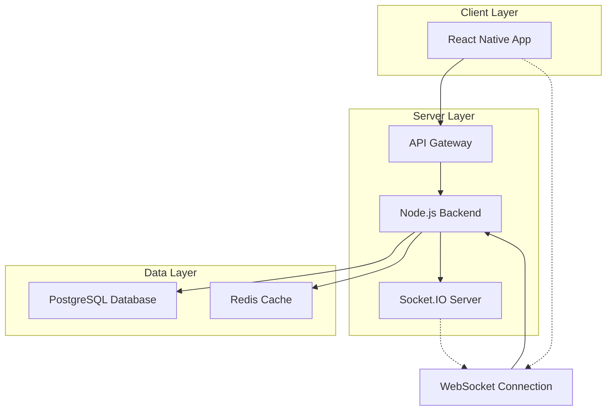

# ConnectVerse - Real-time Social Metaverse

<p align="center">
  
  
  
  
  
</p>

**Target Company:** Meta

## 📋 Table of Contents
* [Core Concept](#-core-concept)
* [System Architecture](#️-system-architecture)
* [Key Features](#-key-features)
* [Technology Stack](#-technology-stack)
* [Engineering Challenges](#-engineering-challenges--solutions)
* [Prerequisites](#-prerequisites)
* [Getting Started](#️-getting-started)
* [Meta-Aligned Features](#-meta-aligned-features)

## 🌟 Core Concept

A mobile-first social application focused on real-time user interaction and performance. This project demonstrates the ability to build engaging, product-centric software with a focus on smooth user experience, low-latency communication, and efficient data handling - core values that align with Meta's vision of connecting people.

## 🏗️ System Architecture



The system uses a client-server architecture optimized for real-time communication. The React Native mobile client communicates with a Node.js backend via REST API for standard operations and WebSocket connections for real-time features. PostgreSQL serves as the primary database, with Redis used for caching to reduce latency and improve user experience.

## 📱 Key Features

- [ ] User authentication with JWT (JSON Web Tokens)
- [ ] Friend request system (send, accept, decline)
- [ ] A simple "wall" or "feed" where users can see posts from friends
- [ ] Real-time one-on-one chat using WebSockets (`socket.io`)
- [ ] Live notifications pushed to the client via WebSockets
- [ ] Efficiently storing and retrieving user data from PostgreSQL
- [ ] Caching frequently accessed data (like user profiles) in Redis

## 🚀 Technology Stack

| Category | Technology | Rationale |
|----------|------------|-----------|
| **Frontend** | React Native + TypeScript | Cross-platform mobile development, aligns with Meta's mobile-first approach |
| **Backend** | Node.js + Express | JavaScript ecosystem consistency, excellent for real-time applications |
| **Database** | PostgreSQL | ACID compliance for user data integrity, excellent for relational social data |
| **Real-time** | Socket.IO | Industry standard for WebSocket management, handles connection scaling |
| **Caching** | Redis | In-memory performance for frequently accessed social feeds and profiles |
| **Testing** | Jest + Detox | Comprehensive unit/integration testing + E2E mobile app testing |
| **Deployment** | Heroku/Fly.io | Rapid deployment with built-in scaling capabilities |

## 🧠 Engineering Challenges & Solutions

### **Challenge 1: Real-time WebSocket Connection Management**
* **Problem:** Managing thousands of concurrent WebSocket connections for real-time chat and notifications without memory leaks or performance degradation.
* **Solution:** Implement connection pooling with Socket.IO rooms, automatic reconnection logic, and heartbeat mechanisms. Use Redis adapter for horizontal scaling across multiple server instances.

### **Challenge 2: Mobile App Performance Optimization**
* **Problem:** Ensuring smooth 60fps performance on both iOS and Android while handling real-time data updates.
* **Solution:** Implement efficient React Native FlatList with getItemLayout, use React.memo for component optimization, and implement selective re-rendering based on data changes.

### **Challenge 3: Efficient Social Feed Caching**
* **Problem:** Delivering personalized feeds to users quickly while maintaining data freshness.
* **Solution:** Multi-layer caching strategy using Redis for user sessions and frequently accessed posts, with intelligent cache invalidation based on user interactions.

## 📋 Prerequisites

- Node.js 18+ and npm
- React Native development environment (Xcode for iOS, Android Studio for Android)
- PostgreSQL 14+
- Redis 6+
- iOS Simulator or Android Emulator

## 🛠️ Getting Started

1. **Clone the repository**
   ```bash
   git clone <repository-url>
   cd ConnectVerse
   ```

2. **Backend Setup**
   ```bash
   cd backend
   npm install
   cp .env.example .env
   # Configure database URLs in .env
   npm run migrate
   ```

3. **Frontend Setup**
   ```bash
   cd mobile
   npm install
   npx pod-install ios  # iOS only
   ```

4. **Database Setup**
   ```bash
   # Start PostgreSQL and Redis locally
   createdb connectverse_db
   redis-server
   ```

5. **Run the Application**
   ```bash
   # Terminal 1: Backend
   cd backend && npm run dev
   
   # Terminal 2: Mobile App
   cd mobile && npx react-native run-ios
   # or
   cd mobile && npx react-native run-android
   ```

## 🧪 Running Tests

- **Backend Tests:** `cd backend && npm test`
- **Frontend Tests:** `cd mobile && npm test`
- **E2E Tests:** `cd mobile && npm run test:e2e`

## 🎯 Meta-Aligned Features

This project showcases skills directly relevant to Meta's engineering culture:

| Meta Focus Area | ConnectVerse Implementation | Why It Matters |
|-----------------|----------------------------|----------------|
| **Real-time Communication** | WebSocket-based chat & notifications | Core to WhatsApp, Messenger, Instagram |
| **Mobile-first Engineering** | React Native cross-platform app | Essential for Meta's app ecosystem |
| **Performance at Scale** | Redis caching + optimized rendering | Critical for billion-user applications |
| **User Engagement** | Live feeds, instant notifications | Central to Meta's product philosophy |
| **Social Graph Management** | Friend connections, relationship modeling | Foundation of Facebook's social platform |

### **Why ConnectVerse Appeals to Meta:**
- Demonstrates understanding of **real-time systems** at the core of Meta's products
- Shows **mobile engineering expertise** crucial for Meta's mobile-first strategy
- Exhibits **performance-conscious development** necessary for global scale
- Proves ability to build **engaging social features** that drive user retention

---

*Built with ❤️ for connecting people in the digital age*
